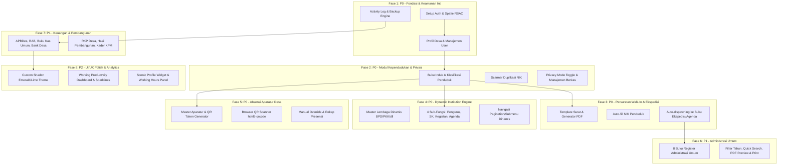

# Plan 00: Master Roadmap & Arsitektur Sistem DIGIDES v2

**Versi Dokumen:** 2.0  
**Status:** Blueprint Induk  
**Referensi PRD:** [PRD_DIGIDES_v2_Final.md](file:///c:/laragon/www/DIGIDES/.claude/plan/PRD_DIGIDES_v2_Final.md)  
**Target Platform:** Laravel 11/13 + PHP 8.2+ + Tailwind CSS / Shadcn UI Custom

---

## 1. Ikhtisar Eksekutif

DIGIDES (Digitalisasi Administrasi dan Pelayanan Desa) adalah platform internal terintegrasi untuk kantor desa yang menggabungkan buku register administrasi umum, manajemen kependudukan dengan proteksi privasi, otomasi persuratan desk-service (*walk-in*), *dynamic institution engine*, absensi QR aparatur, serta tata kelola keuangan dan pembangunan desa.

Sistem ini **khusus internal** (Admin Desa & Staff Desa). Tidak ada portal publik masyarakat mandiri (*self-service*).

---

## 2. Peta Jalan Pengembangan (Phase & Priority Matrix)



---

## 3. Daftar Modul File Plan

Setiap fase memiliki dokumen implementasi teknis tersendiri:

| File Plan | Judul Fase & Lingkup | Prioritas |
|---|---|:---:|
| [01_phase1_core_infrastructure_auth_rbac.md](file:///c:/laragon/www/DIGIDES/.claude/plan/01_phase1_core_infrastructure_auth_rbac.md) | Auth, Spatie RBAC, Profil Desa, User Management, Activity Log, Backup System | P0 |
| [02_phase2_modul_kependudukan.md](file:///c:/laragon/www/DIGIDES/.claude/plan/02_phase2_modul_kependudukan.md) | Buku Induk, Mutasi, Cek Duplikasi NIK, Privacy Mode, Manajemen Dokumen Warga | P0 |
| [03_phase3_modul_persuratan_ekspedisi.md](file:///c:/laragon/www/DIGIDES/.claude/plan/03_phase3_modul_persuratan_ekspedisi.md) | Layanan Surat Walk-In, Template PDF Resmi, Integrasi Otomatis Buku Ekspedisi | P0 |
| [04_phase4_modul_kelembagaan_dinamis.md](file:///c:/laragon/www/DIGIDES/.claude/plan/04_phase4_modul_kelembagaan_dinamis.md) | Dynamic Institution Engine (BPD, PKK, Posyandu, BUMDes, dll) & 4 Sub-Fungsi | P0 |
| [05_phase5_modul_absensi_aparatur.md](file:///c:/laragon/www/DIGIDES/.claude/plan/05_phase5_modul_absensi_aparatur.md) | Master Aparat, QR Code Scanner Browser, Manual Attendance, Status Rekap | P0 |
| [06_phase6_modul_administrasi_umum.md](file:///c:/laragon/www/DIGIDES/.claude/plan/06_phase6_modul_administrasi_umum.md) | 8 Buku Register Umum, Filter Tahun, PDF Viewer Modal, Export & Print | P1 |
| [07_phase7_modul_keuangan_pembangunan.md](file:///c:/laragon/www/DIGIDES/.claude/plan/07_phase7_modul_keuangan_pembangunan.md) | Keuangan APBDes & Kas + Modul RKP & Hasil Pembangunan | P1 |
| [08_design_system_and_ui_standards.md](file:///c:/laragon/www/DIGIDES/.claude/plan/08_design_system_and_ui_standards.md) | Standar Desain Visual, Custom Shadcn UI, Palet Emerald/Pine/Lime & Layout 3 Kolom | P0-P2 |

---

## 4. Arsitektur Relasi Basis Data Global

```text
users (id, name, email, password, status, avatar, created_at, ...)
roles & permissions (Spatie tables: roles, permissions, model_has_roles, model_has_permissions)

desa_profile (id, nama_desa, kode_desa, kecamatan, kabupaten, provinsi, kode_pos, alamat, email, telepon, website, logo, kades_nama, kades_nip, kades_nik)

penduduk (id, nik, no_kk, nama_lengkap, tempat_lahir, tgl_lahir, jenis_kelamin, agama, status_perkawinan, pekerjaan, pendidikan, alamat, rt, rw, dusun, status_kependudukan, status_mutasi, sumber_data, created_at, ...)
penduduk_documents (id, penduduk_id, jenis_dokumen, file_path, file_size, mime_type, created_at)
penduduk_mutasi (id, penduduk_id, jenis_mutasi, tanggal_mutasi, keterangan, berkas_bukti)

surat_templates (id, kode_surat, nama_surat, template_body, required_fields_json, is_active)
surat_arsip (id, nomor_surat, surat_template_id, penduduk_id, user_id, form_data_json, file_pdf_path, created_at)
buku_ekspedisi (id, nomor_urut, tanggal_kirim, nomor_surat, tanggal_surat, perihal, tujuan, penerima, surat_arsip_id, created_at)
buku_agenda (id, nomor_urut, jenis_agenda, nomor_surat, tanggal_surat, tanggal_terima, pengirim_penerima, isi_ringkas, file_pdf_path)

institutions (id, nama_lembaga, singkatan, slug, kategori, nomor_sk_pendirian, deskripsi, logo_path, created_at)
institution_members (id, institution_id, penduduk_id, jabatan, no_sk, tgl_sk, tgl_mulai, tgl_selesai, file_sk_path, status_aktif)
institution_decisions (id, institution_id, no_keputusan, tgl_keputusan, tentang, uraian, file_pdf_path)
institution_activities (id, institution_id, nama_kegiatan, tgl_kegiatan, lokasi, pelaksana, anggaran, uraian, dokumentasi_img_path)
institution_agendas (id, institution_id, jenis_surat, no_surat, tgl_surat, perihal, pengirim_penerima, file_pdf_path)

aparatur (id, penduduk_id, nip, jabatan, qr_token, status_kepegawaian, jam_kerja_mulai, jam_kerja_selesai, status_aktif)
absensi (id, aparatur_id, tanggal, jam_masuk, jam_pulang, status_kehadiran, metode_absen, keterangan, latitude, longitude)

buku_umum_peraturan (id, jenis_peraturan, nomor_ditetapkan, tanggal_ditetapkan, tentang, nomor_diundangkan, file_pdf_path, tahun)
buku_umum_inventaris (id, nama_barang, asal_barang, tahun_pengadaan, kondisi, jumlah, lokasi, keterangan, tahun)
buku_umum_tanah (id, nomor_sertifikat, lokasi, luas_m2, status_hak, penggunaan, keterangan)

keuangan_apbdes (id, tahun_anggaran, jenis, kode_rekening, uraian, anggaran, realisasi, sumber_dana)
keuangan_kas_umum (id, tanggal, no_bukti, jenis_transaksi, kode_rekening, uraian, penerimaan, pengeluaran, saldo, file_bukti_path)
keuangan_bank (id, tanggal, no_transaksi, jenis_transaksi, uraian, setor, tarik, saldo_bank, bunga, biaya_admin)

pembangunan_rkp (id, tahun, nama_proyek, lokasi, volume, perkiraan_biaya, sumber_dana, pelaksana, status_pelaksanaan)
pembangunan_hasil (id, nama_hasil, lokasi, volume, biaya_akhir, tahun_selesai, kondisi, pemanfaat)
pembangunan_kpm (id, penduduk_id, bidang_tugas, no_sk, status_aktif)

activity_logs (Spatie Activitylog tables)
backup_records (id, user_id, filename, disk, size_bytes, backup_type, status, created_at)
```
