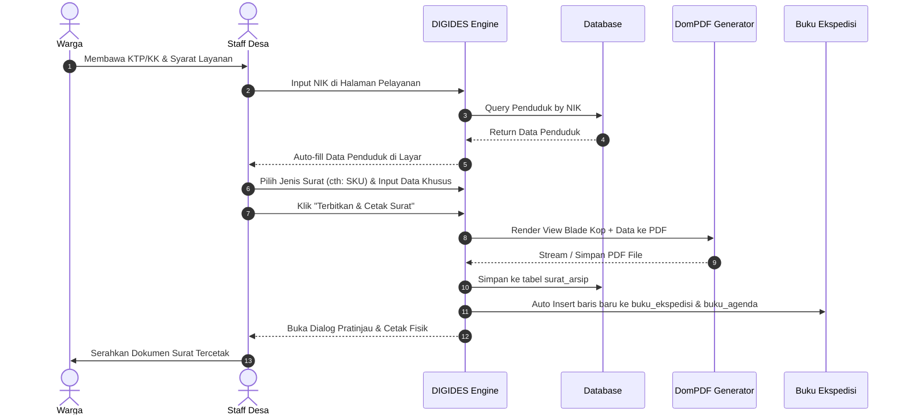

# Plan 03: Pelayanan Persuratan Walk-In & Integrasi Buku Ekspedisi (Fase 3 - Prioritas P0)

**Modul:** Persuratan Meja Pelayanan (*Desk-Service*), Generator Template PDF, Auto-fill NIK Penduduk, Otomasi Buku Ekspedisi & Agenda  
**Referensi PRD:** Section 1 (Poin 3), 5.3, 6.1, 8 (Fase 1)

---

## 1. Tujuan & Ruang Lingkup
Mengotomatisasi alur penerbitan surat pengantar dan keterangan saat warga datang langsung ke kantor desa (*walk-in service*). Surat dicetak seketika dalam format PDF resmi berstandar kop desa, dan data registrasinya langsung terhubung tanpa jeda ke **Buku Ekspedisi** dan **Buku Agenda Surat Keluar**.

### Fitur Utama:
1. **Pencarian Cepat Data Pemohon:**
   - Input NIK/Nama di bilah pelayanan -> Sistem otomatis menarik data lengkap penduduk (Nama, TTL, Jenis Kelamin, Agama, Pekerjaan, Alamat, Status).
2. **Katalog & Template Surat Resmi:**
   - Surat Keterangan Usaha (SKU)
   - Surat Keterangan Tidak Mampu (SKTM)
   - Surat Keterangan Domisili
   - Surat Pengantar SKCK
   - Surat Keterangan Kelahiran / Kematian
   - Surat Keterangan Belum Menikah / Nikah (N1-N4)
   - Surat Keterangan Pindah Penduduk
   - Surat Keterangan Jalan / Bepergian
3. **Formulir Isian Variabel Khusus:**
   - Form dinamis sesuai jenis surat yang dipilih (misal SKU: nama usaha, bidang, alamat usaha; SKTM: keperluan sekolah/rumah sakit).
4. **PDF Generator & Pratinjau Siap Cetak:**
   - Menggunakan `barryvdh/laravel-dompdf` dengan tata letak kop surat resmi, logo desa, nomor surat terstandar, tanda tangan Kades / Sekretaris Desa, dan barcode verifikasi arsip.
5. **Integrasi Otomatis Buku Ekspedisi & Agenda:**
   - Saat surat diterbitkan (*generated*), sistem secara otomatis mengeksekusi *Event/Listener* untuk memasukkan baris baru pada tabel `buku_ekspedisi` dan `buku_agenda`.

---

## 2. Struktur Database & Migrasi

### Tabel `surat_templates`
- `id` (bigint, PK)
- `kode_surat` (string: 20, unique - contoh: 'SKU', 'SKTM', 'DOMISILI')
- `nama_surat` (string)
- `penomoran_format` (string - contoh: '470/{no}/DS-SKM/{bulan}/{tahun}')
- `template_blade` (string)
- `schema_fields_json` (json - daftar input variabel khusus)
- `is_active` (boolean, default true)
- `created_at`, `updated_at`

### Tabel `surat_arsip`
- `id` (bigint, PK)
- `nomor_surat` (string, unique, index)
- `surat_template_id` (foreignId -> surat_templates.id)
- `penduduk_id` (foreignId -> penduduk.id)
- `user_id` (foreignId -> users.id - Staff pencatat)
- `keperluan` (text)
- `payload_data` (json - salinan lengkap snapshot data penduduk & variabel form)
- `file_pdf_path` (string)
- `tanggal_terbit` (date)
- `status` (enum: 'draft', 'terbit', 'dibatalkan')
- `created_at`, `updated_at`

### Tabel `buku_ekspedisi`
- `id` (bigint, PK)
- `nomor_urut` (integer, index)
- `tahun` (integer: 4, index)
- `tanggal_pengiriman` (date)
- `nomor_surat` (string)
- `tanggal_surat` (date)
- `perihal` (text)
- `tujuan_penerima` (string)
- `petugas_pengirim` (string)
- `surat_arsip_id` (foreignId -> surat_arsip.id, nullable)
- `catatan` (text, nullable)
- `created_at`, `updated_at`

---

## 3. Rincian Alur Layanan (Flow Diagram)



---

## 4. Rincian Implementasi Teknis

1. **Instalasi Paket PDF:**
   ```bash
   composer require barryvdh/laravel-dompdf
   ```
2. **Event & Listener Otomasi:**
   - Event: `App\Events\SuratTerbitEvent`
   - Listener: `App\Listeners\SyncSuratToBukuEkspedisiListener`
3. **Template Blade PDF:**
   - `resources/views/pdf/layouts/kop_surat.blade.php`
   - `resources/views/pdf/surat/sku.blade.php`
   - `resources/views/pdf/surat/sktm.blade.php`
   - `resources/views/pdf/surat/domisili.blade.php`
   - `resources/views/pdf/surat/skck.blade.php`
4. **Controller:**
   - `App\Http\Controllers\Persuratan\PelayananSuratController` (Live Search NIK, Form Wizard, Generate & Download)
   - `App\Http\Controllers\Persuratan\ArsipSuratController` (Daftar Riwayat, Filter Jenis & Tanggal)
   - `App\Http\Controllers\Administrasi\BukuEkspedisiController` (Pencatatan Buku Ekspedisi Terintegrasi)

---

## 5. Rencana Pengujian (Verification Plan)

- [ ] Cari NIK yang terdaftar: Pastikan data otomatis terisi ke form persuratan tanpa lag.
- [ ] Terbitkan Surat Keterangan Usaha (SKU) dan unduh PDF: Pastikan kop surat, logo, nomor surat, dan tanda tangan tertata rapi.
- [ ] Periksa tabel `buku_ekspedisi` dan `buku_agenda`: Pastikan nomor surat dan data penerima langsung terdaftar tanpa entri manual.
